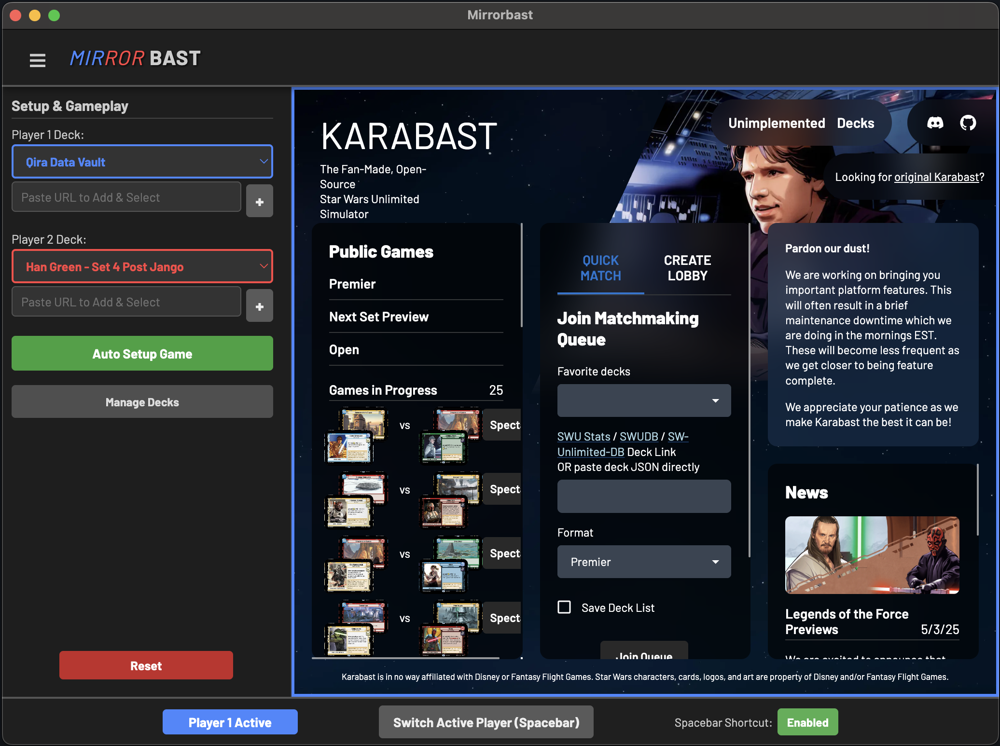

# Mirrorbast

Mirrorbast is a simple desktop application designed to wrap the web-based card game client Karabast so that it can be played by a single player using two decks, with easy setup and switching between both sides of the table for deck-testing purposes.

 

## How to Use

* When the Mirrorbast application starts, you'll see two inputs for SWUDB deck urls (one for each "player"). 
* Enter the two decks that you want to test against eachother, and click "Auto Setup Game'. 
* The app will automatically set up a private lobby with both decks. 
  * This is automated and takes a few seconds, so sit back and let it do its thing. 
  * Clicking stuff during this phase can break the automation and you'll have to reset.
* Once finished, you can click the "Switch Active Player" button in the footer, or just hit spacebar, to toggle between the two "players" in order to play against yourself.

## ⚠️ Alpha Software - Expect Bugs! ⚠️

**Please be aware:** This application is currently in an **alpha** stage.

I vibe coded this thing with AI over two days of paternity leave while taking care of a newborn, so keep your expectations reasonably low 😅

* **Bugs are expected and likely.** Features might be incomplete or unstable.

Use this software with the understanding that it's an early experiment. Feel free to report issues or contribute if you're interested!

## Untrusted Application Warnings

I do not have a paid developer license, so I cannot publish this application as a signed, trusted app. Depending on your platform, you'll likely see some kind of safety warning about the application not being trusted. I've included instructions below for each platform that will let you proceed despite the warning. Obviously proceed at your own risk, but just know that the warning is expected. Even as the app developer, I also have to bypass the security warning to run the app on my own machine.

## Installation

The easiest way to install Mirrorbast is to download the latest release for your operating system from the **[Releases Page](https://github.com/pmossman/mirrorbast/releases)** on GitHub.

Find the release corresponding to the version you want (usually the latest) and download the appropriate file for your system:

* **Windows:** Download the `.exe` file (e.g., `mirrorbast-vX.Y.Z-windows-x64.exe`).
* **macOS:** Download the `.zip` file (e.g., `mirrorbast-vX.Y.Z-macos-arm64.zip`). *(Note: Filename might vary slightly based on architecture)*.
* **Linux (Debian/Ubuntu):** Download the `.deb` file (e.g., `mirrorbast-vX.Y.Z-linux-amd64.deb`).

### Running the Application

#### Windows

1.  Download the `mirrorbast-vX.Y.Z-windows-x64.exe` installer.
2.  Double-click the downloaded `.exe` file to run the installer.
3.  **Important:** Windows Defender SmartScreen will likely show a warning ("Windows protected your PC") because the application is not code-signed by a recognized publisher.
    * Click **"More info"**.
    * Then click **"Run anyway"**.
4.  Follow the installer prompts. The application should install and launch.

#### macOS

1.  Download the `mirrorbast-vX.Y.Z-macos-arm64.zip` file.
2.  Double-click the downloaded `.zip` file to extract the `Mirrorbast.app` application bundle (usually extracts to the same folder, e.g., Downloads).
3.  **Drag the `Mirrorbast.app` icon into your Applications folder.**
4.  **Important macOS Workaround:** Due to macOS Gatekeeper security settings for applications downloaded from the internet that aren't signed by a recognized Apple Developer, you will likely encounter an error message saying **""Mirrorbast" is damaged and can’t be opened. You should move it to the Trash."** To fix this, you need to manually remove the quarantine attribute using the Terminal:
    * Open the **Terminal** app (you can find it in Applications > Utilities, or search via Spotlight).
    * Copy and paste the following command **exactly** and press Enter:
      ```bash
      xattr -cr /Applications/Mirrorbast.app
      ```
    * This command removes the quarantine attributes. After running it, you should be able to double-click the Mirrorbast app in your Applications folder to open it.
    * **Note:** You *might* still need to perform the standard **right-click -> Open** procedure the very first time you launch the app after running the `xattr` command if you see an "unidentified developer" warning.

#### Linux (Debian/Ubuntu)

1.  Download the `mirrorbast-vX.Y.Z-linux-amd64.deb` file.
2.  You can usually install `.deb` files by double-clicking them in your file manager, which should open a package installer (like Ubuntu Software or GDebi).
3.  Alternatively, you can install it from the terminal:
    ```bash
    # Navigate to the directory where you downloaded the file
    cd ~/Downloads 
    
    # Install the package (replace vX.Y.Z with the actual version)
    sudo dpkg -i mirrorbast-vX.Y.Z-linux-amd64.deb
    
    # If you encounter dependency issues, run:
    sudo apt-get install -f 
    ```
4.  Once installed, you should find Mirrorbast in your application menu.

## Development

If you want to build or modify the application yourself:

1.  Clone the repository: `git clone https://github.com/pmossman/mirrorbast.git`
2.  Navigate into the directory: `cd mirrorbast`
3.  Install dependencies: `npm install`
4.  Run in development mode: `npm start`
5.  Build distributables: `npm run dist` (uses electron-builder).
